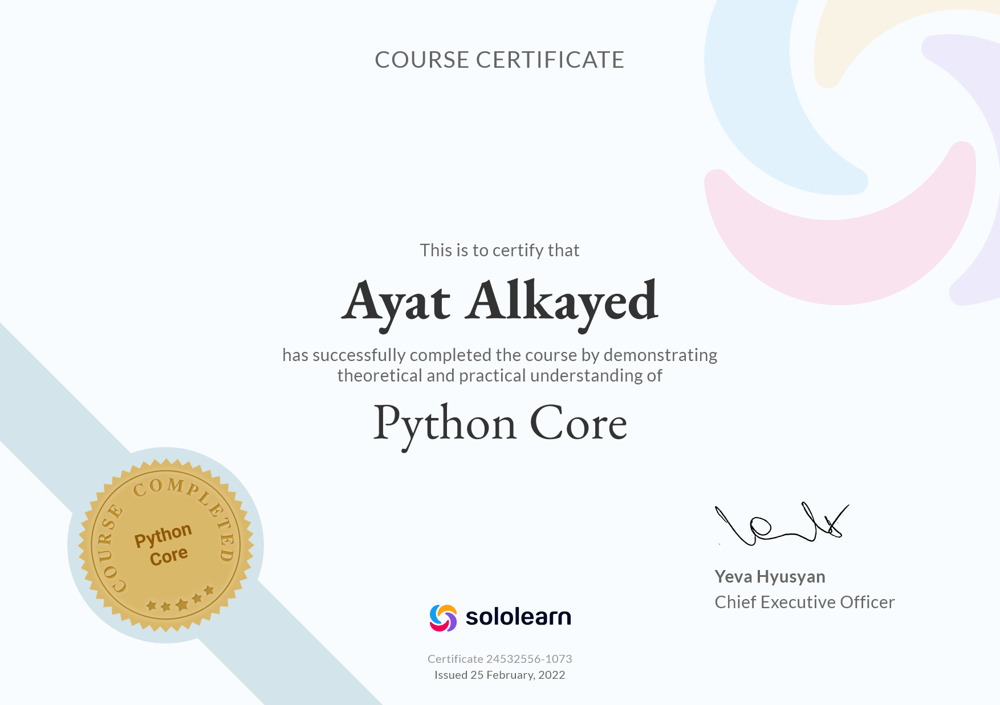

# ***Reading Notes***
This site will resnder the summary of the rasding tasks for Python 401 course.
## *Code 102 - Intro to Software Development*
- [Code Challenges/JS](https://github.com/ayat93a/solving-problem)
- [Code Challenges /JS](https://github.com/ayat93a/Prep-Challenges)
- [Movie Library-Backend with node.js , postgressSQL and API](https://github.com/ayat93a/Movies-Library)
- [Movie Library -Frontend with React](https://github.com/ayat93a/Netflix-Clone)
___
## *Code 201 - Foundations of Software Development*

___
## *Code 301 - Intermediate Software Development*
___
## *Code 401 - Advanced Software Development*
| Task  | Link |
|----------|:-------------:|
| Terminal  |[TerminalOperation_Notes](./Terminal_operation.md)|
| SQL      | [SQL_Notes](./SQL.md)|
| Mindset     | [Mindset_Notes](./Mindset.md)|

___
## *Class Read*
| Task  | Link |
|----------|:-------------:|
|Read: Class 01|[Class 01](./Read:Class01.md)|
|Read: Class 03|[Class 03](./ReadClass03.md)|
|Read: Class 04|[Class 04](./Read%3AClass04.md)|
|Read: Class 05|[Class 05](./Linked_list_big_O.md)
|Read: Class 06|[Class 06](./class06.md)
|Read: Class 07|[Class 07](./ReadClass07.md)|
|Read: Class 08|[Class 08](./Class%2008.md)
|Read: Class 09|[Class 09](./READ09.md)
|Read: Class 10|[Class 10](./Read%3AClass_10.md)
|Read: Class 11|[Class 11](./Class_11.md)
___
## my_notes
| Topics  | Link |
|----------|:-------------:|
|`if __name__ == __main__` | [special variables](./special%20_variables.md)|
|file operation|[file operation](./file_oprtation.md)|
|object-oriented programming(OOP)|[OOP](./OOP)|