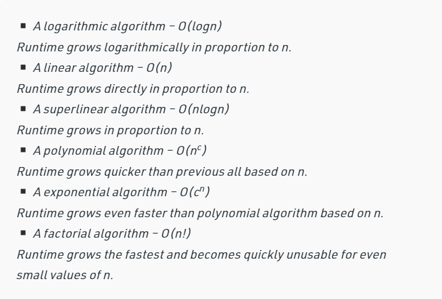
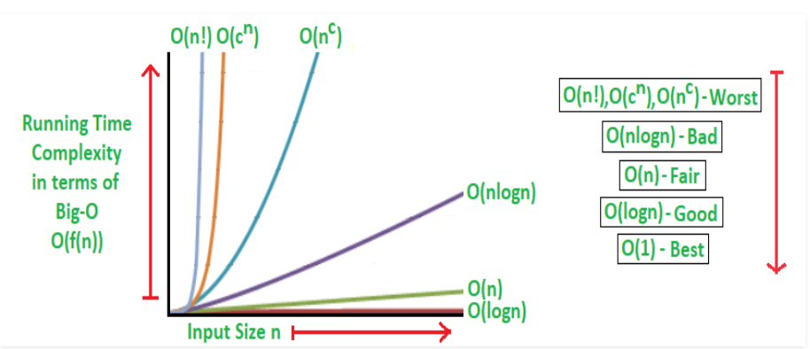
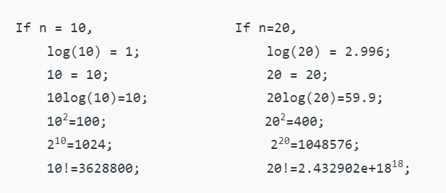

# Pain and Suffering
With No Pain there is No Gain
Pain is nessecary for big dream, suffer is just suffer.
I have 10 weeks to can achive my gole in being a *WEB DEVELOPER* and can complete my first project in *Artificial Intelligence*

# Beginners Guide to Big O

## What big O notation is
___
Big O notation is a symbology used to express the asymptotic behavior of functions in complexity theory, computer science, and mathematics. It essentially shows you how quickly a function increases or diminishes, The letter `O` is used because the rate of growth of a
function is also called its order.
### Illistraion example 
when analyzing some algorithm, one might find that the time (or the
number of steps) it takes to complete a problem of size n is given by [T(n) = 4 n ^2 - 2 n + 2].
If we ignore constants (which makes sense because those depend on the particular
hardware the program is run on ~ We can say that its the number of console.log that will excute for the same algorithem as mentioned in ref #2 **~) and slower growing terms, we could say `T(n) grows at the order of n^2  and write:T(n) = O(n^2). ==> this example from ref#3.

**There are no constants or low-order terms in the big-O expressions. This is because constants and low-order terms don't matter when N is high enough (a constant-time method will be quicker than a linear-time approach, which will be faster than a quadratic-time algorithm).
For a problem of size N:
- a constant-time algorithm is "order 1": O(1)
- a linear-time algorithm is "order N": O(N)
- a quadratic-time algorithm is "order N squared": O(N^2)

## Why O notation 
___
What is the efficiency of an algorithm or a line of code? Efficiency encompasses a wide range of resources, including: 
-  CPU (processing) time 
-  memory utilization
-  disk usage 
- network usage.
All are significant, but we'll focus on time complexity (CPU usage).
The Performance is measured by how much time/memory/disk/... is actually used when a program is run. This depends on the machine, compiler, etc. as well as the code Complexity.
Complexity mainly mean what happens as the size of the problem being solved gets larger? and that what the reason for why the big O notation are measured.

## How to calculate big O notation
*We express complexity using big-O notation.* ; Big O is a term that indicates the worst-case scenario and may be used to describe the amount of time an algorithm takes to execute or the amount of space it takes up (in memory or on disk).

The following is the general step-by-step process for Big-O runtime analysis:#Ref 4
- Figure out what the input is and what n represents.
- Express the maximum number of operations, the algorithm performs in terms of n.
- Eliminate all excluding the highest order terms.
- Remove all the constant factors. 
*For any algorithm, the Big-O analysis should be straightforward as long as we correctly identify the operations that are dependent on n, the input size.*
### Runtime Analysis of Algorithms 
In most cases, we performed performance analysis to assess and evaluate the worst-case theoretical running time complexities of algorithms.
Any algorithm's quickest feasible running time is O(1), also known as Constant Running Time. In this situation, regardless of the quantity of the input, the algorithm takes the same amount of time to run. This is the optimal algorithm runtime, however it is seldom achieved.
In practice, an algorithm's performance (Runtime) is determined by n, which refers to the amount of the input or the number of operations necessary for each input item.
From best to worst performance (Running Time Complexity), the algorithms are categorised as follows:

Where, n is the input size and c is a positive constant. 

## Mathematical Examples of Runtime Analysis: 

___
#### Referances
1. [Programming with Mosh](https://www.youtube.com/watch?v=BBpAmxU_NQo)
2. [Web Dev Simplified](https://www.youtube.com/watch?v=itn09C2ZB9Y&t=72s)
3. [MIT Big Notation Lecture](http://web.mit.edu/16.070/www/lecture/big_o.pdf)
4. [geeksforgeeks](https://www.geeksforgeeks.org/analysis-algorithms-big-o-analysis/)