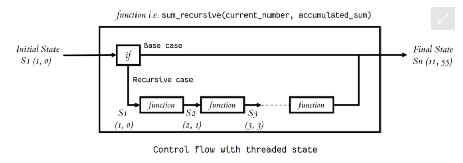

# Classes and Objects
## Definition
- Classes are  a template to create an objects.
- Objects are a container of variables and functions into a single entity.
-  Objects get their variables and functions from classes. 

### basic class would look like -->\
```
class MyClass:
    variable = "blah"

    def function(self):
        print("This is a message inside the class.")
```
to assign the class(template) to an object -->\
`myobjectx = MyClass()`\
--> the variable "`myobjectx`" holds an object of the class "`MyClass`" that contains the variable and the function defined within the class.

## Accessing Object Variables
object_name.variable_name -->\
`myobjectx.variable`

You can create multiple different objects that are of the same class(have the same variables and functions defined). -->\
each object contains independent copies of the variables defined in the class. For instance, if we were to define another object with the "MyClass" class and then change the string in the variable above:

## Accessing Object Functions
`myobjectx.function()`

## init()
The `__init__()` function, is a special function that is called when the class is being initiated. It's used for asigning values in a class.

``` 
class NumberHolder:
   def __init__(self, number):
       self.number = number
```

# Thinking Recursively in Python
The main concept in think Recursively term is If the current problem represents a simple case, solve it. If not, divide it into subproblems and apply the same strategy to them.\
A recursive function is a function defined in terms of itself via self-referential expressions.\
This means that the function will continue to call itself and repeat its behavior until some condition is met to return a result.\
 All recursive functions share a common structure made up of two parts: base case and recursive case.\
--> Steps to demonstrate this structure :
- Decompose the original problem into simpler instances of the same problem. 
- As the large problem is broken down into successively less complex ones, those subproblems must eventually become so simple that they can be solved without further subdivision.\
Behind the scenes, each recursive call adds a stack frame (containing its execution context) to the call stack until we reach the base case. Then, the stack begins to unwind as each call returns its results.
## Maintaining State
 keep in mind that each recursive call has its own execution context, so to maintain state during recursion you have to either:
 - Thread the state through each recursive call so that the current state is part of the current call’s execution context\
The figure below shows an example of control flow with threaded state


 - Keep the state in global scope

 ## Recursive Data Structures in Python
 A data structure is recursive if it can be defined in terms of a smaller version of itself. A list , set, dictionary, and tree are examples of a recursive data structure.

# Python Testing with pytest: Fixtures and Coverage
## Fixtures
--> to have some objects available to all of your tests. Those objects might contain data you want to share across tests, or they might involve the network or filesystem.\
In pytest, you define fixtures using a combination of the pytest.fixture decorator, along with a function definition.

## Coverage
code coverage doesn't mean that your code is perfect or that it lacks bugs. But it does give you a greater degree of confidence in the code and the fact that it has been run at least once.\
there's a package called pytest-cov on PyPI that you can download and install. Once that's done, you can invoke pytest with the --cov option. If you don't say anything more than that, you'll get a coverage report for every part of the Python library that your program used

[Back to main](./README.md)

