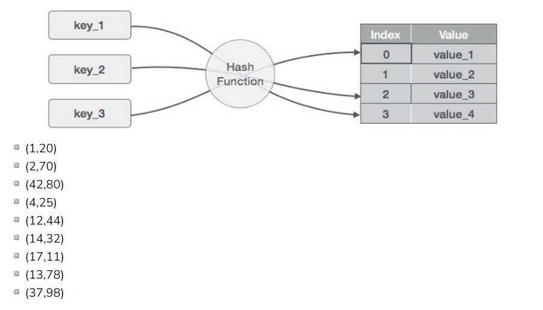
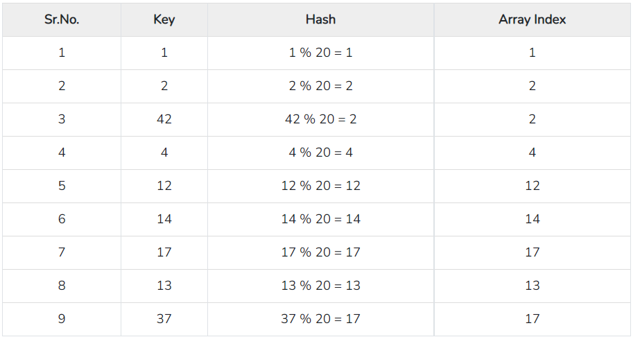

# Hash Table
- Hash Table is a data structure which stores data in an associative manner. In a hash table, data is stored in an array format, where each data value has its own unique index value. Access of data becomes very fast if we know the index of the desired data.

- Thus, it becomes a data structure in which insertion and search operations are very fast irrespective of the size of the data. Hash Table uses an array as a storage medium and uses hash technique to generate an index where an element is to be inserted or is to be located from.

# Hashing
Hashing is a technique to convert a range of key values into a range of indexes of an array. We're going to use modulo operator to get a range of key values. Consider an example of hash table of size 20, and the following items are to be stored. Item are in the (key,value) format.

# Basic Operations
Following are the basic primary operations of a hash table.

- Search − Searches an element in a hash table.

- Insert − inserts an element in a hash table.

- delete − Deletes an element from a hash table.

# Search Operation
Whenever an element is to be searched, compute the hash code of the key passed and locate the element using that hash code as index in the array. Use linear probing to get the element ahead if the element is not found at the computed hash code.

# Insert Operation
Whenever an element is to be inserted, compute the hash code of the key passed and locate the index using that hash code as an index in the array. Use linear probing for empty location, if an element is found at the computed hash code.

# Delete Operation
Whenever an element is to be deleted, compute the hash code of the key passed and locate the index using that hash code as an index in the array. Use linear probing to get the element ahead if an element is not found at the computed hash code. When found, store a dummy item there to keep the performance of the hash table intact.
